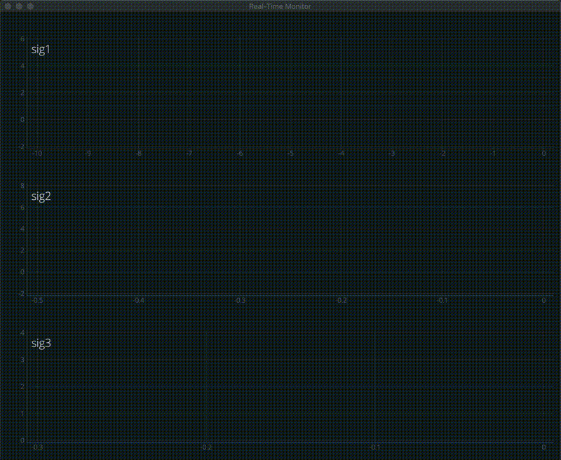

# Real-time Data Monitoring Tool with data streaming

TCP Socketで受信したストリーミングデータをリアルタイムにグラフ表示します。  
高速でサンプリングされるセンサーデータなどの確認用途として利用されることを想定しています。  
画面描画を高速化するためにPyQtGraphを利用しています。依存パッケージはソースコードを参照し準備してください。  

## 共通設定
### app.py
ホストPCのIPアドレスとPort番号を設定します。  

```python
host = "localhost"      # set host IP address
port = 5000             # set host port number
```

### SignalData.py
保持するデータバッファサイズを設定します。グラフ表示範囲のデータ点数により決定します。  
例) 10msサンプリング, 10秒表示 = 100サンプル/秒 × 10秒 = 1000  

```python
DATA_BUF_SIZE = 1000   # set data buffer size
```

### TcpSocket.py
データ長を受信できるsocket受信バッファサイズを設定します。  

```python
RECV_BUF_SIZE = 2048    # set socket buffer size
```

## 画面設定
`conf.json`を編集し、グラフ表示画面のレイアウト設定を行います。  
`信号名:{グラフ設定, ...}`で1つのグラフ領域が記載順に画面上から下へ作成されます。  

### 例
```json
{
    "sig1" :{"xrange":[-10, 0], "yrange":[-2, 6], "xtics":[2, 1], "ytics":[2, 1], "plot":"line", "color":0, "digit":2},
    "sig2" :{"xrange":[-0.5, 0], "yrange":[-2, 8], "xtics":[0.5, 0.1], "ytics":[2, 2], "plot":"line-point", "color":1, "digit":3},
    "sig3" :{"xrange":[-0.3, 0], "yrange":[0, 4], "xtics":[0.1, 0.1], "ytics":[1, 1], "plot":"point", "color":2, "digit":4},
    "sig4" :{"layer":"sig1", "plot":"line", "color":4, "digit":5},
    "sig5" :{"layer":"sig2", "plot":"line", "color":5, "digit":6}
}
```

### グラフ設定
| field name | description          | exsample     | setting                         |
| :---------:| :------------------- | :----------: | :------------------------------ |
| xrange     | x軸表示範囲          | [-10,10]     | -10〜10秒を表示範囲とする       |
| yrange     | y軸表示範囲          | [-5,5]       | 値-5〜5を表示範囲とする         |
| xtics      | x軸メモリ表示設定    | [5,1]        | 主軸5秒間隔、複軸1秒間隔とする  |
| ytics      | y軸メモリ表示設定    | [10,5]       | 主軸10秒間隔、複軸5秒間隔とする |
| plot       | 描画スタイル         | line         | 線描画                          |
|            |                      | line-point   | 線+サンプリング点描画           |
|            |                      | point        | サンプリング点描画              |
| color      | 描画色               | 0〜5         |                                 |
| digit      | データ値表示有効桁数 | 2            | 小数点以下2桁表示               |
| layer      | 重ね書き指定         | sig1         | 信号名sig1のグラフ領域に重ね書きする（上段に対象信号グラフ領域が定義されていること） |

重ね書き設定がされているグラフ領域の`xrange`,`yrange`,`xtics`,`ytics`は無視されます。  

## 受信データフォーマット
TCP Socketで受信するデータフォーマットは以下に従います。  

### サンプリングデータ例（JSONメッセージ）
```json
{
    "t":"1567269124.711618",
    "d": {
        "sig1": "-0.971061100",
        "sig2": "0.028938900",
        "sig3": "1.028938900"
        ...
    }
}
```

### フィールド
| field name | sub field name | description               |
| :---------:| :------------: | :-----------------------: |
| t          | -              | タイムスタンプ (unixtime) |
| d          | -              | データフィールド          |
|            | 信号名         | 信号値                    |

信号名はグラフ設定における信号名となります。

## テスト
`/test/tcpsocket_send.py`を実行しダミーデータを送信します。
``` bash
$ python3 tcpsocket_send.py
```

アプリケーションを起動します。
```bash
$ python3 app.py
```

### 実行結果



